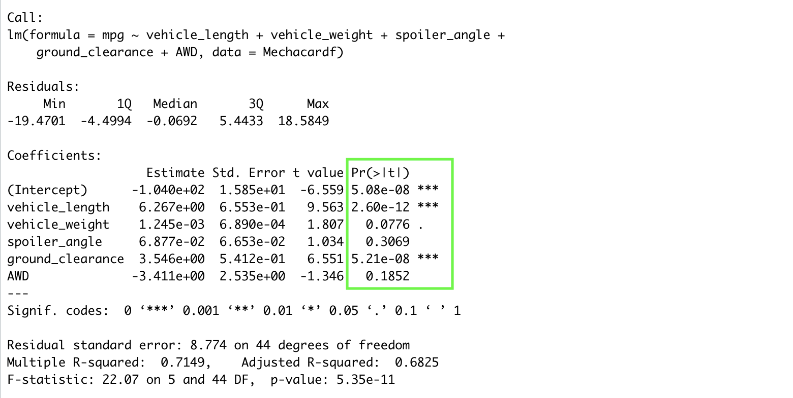

# MechaCar_Statistical_Analysis

## PROJECT OVERVIEW
This project aims to analyse the production data of AutosRU's newest prototype, the MechCar, as it is suffering from production troubles. The main purposes of this project are outlines as below;
- Perform multiple linear regression analysis to identify which variables in the dataset predict the mpg of MechaCar prototypes.
- Collect summary statistics on the pound per square inch (PSI) of the suspension coils from the manufacturing lots.
- Run t-tests to determine if the manufacturing lots are statistically different from the mean population.
- Design a statistical study to compare vehicle performance of the MechaCar vehicles from other manufacturers. 

Tools used: R Studio
Programming Language: R
Source of data: MechaCar_mpg_csv, Suspension_Coil.csv

## Linear Regression to Predict MPG

Our multiple linear regression statement is;
lm(mpg~vehicle_length+vehicle_weight+spoiler_angle+ground_clearance+AWD, data=Mechacardf)

- In the summary output we can see that, spoiler_angle and vehicle_length have a significant impact on mpg values. In other words, these two variables provided a non-random amount of variance to the mpg values in the dataset.

- The linear regression model of our dataset is;
mpg=9.56(vehicle_length)+1.81(vehicle_weight)+1.03(spoiler_angle)+6.55(ground_clearance)-1.35(AWD)-6.559

- P value of our linear regression analysis is 5.35e-11 which is smaller than our assumed significance of 0.05%. Therefore there is sufficient evidence to reject our null hypothesis, which means that the slope our linear model is not zero.

- Multiple R-square in 0.7149 which means that roughly 71.49% of the variability of dependent variable 'mpg' is explained using this model. Adjusted R-squared in 0.6825 

## Summary Statistics on Suspension Coils

 To determine if the manufacturing process is consistent across production lots, weight capacities of multiple suspension coils were tested.

The following metrics mean, median, variance, and standard deviation were calculated.
- For PSI column

- For each manufacturing lot

The design specifications for the MechaCar suspension coils dictate that the variance of the suspension coils must not exceed 100 pounds per square inch.

- The variance for PSI column in total is 62.29. So, the current manufacturing data meet this design specifications for all manufacturing lot in total. However for Manufacturing Lot 3, the variance is high i.e. 170.29 which is greater than the design specification standard. 

## T-Tests on Suspension Coils

### One sample T-test on all manufacturing lots

- The test statistic of the t-test is -1.8931.
- The degree of freedom for the t-test statistic is 149.
- The p-value is 0.06028. 
- The sample mean is 1498.78.

Conclusion: Since the p-value (0.09549) is greater than the level of significance (0.05), we fail to reject the null hypothesis.
This means that we donot have sufficient evidence to say that the mean of all manufacturing lots is statistically different from the population mean of 1500 per square inch.

### One sample T-test on each manufacturing lot

- For Lot 1, p value is 1 and for Lot 2 p value is 0.6072, which are greater than the level of significance (0.05), thus we fail to reject the null hypothesis i.e.
we donot have sufficient evidence to say that the mean of each Lot 1 and Lot 2 individually are statistically different from the population mean of 1500 per square inch.
- For Lot 3, p value is 0.04168 which is less than the level of significance (0.05), thus we reject the null hypothesis i.e.
 the mean of Lot 3 is statistically different from the population mean of 1500 per square inch.

## Study Design: MechaCar vs Competition.
With the knowledge of R, a statistical study is designed to quantify the performance of MechaCar against the competition.

The metrics that will be tested is highway fuel efficiency and vehicle weight of different competitors considering that consumers will be concerned regarding fuel price. 

Null Hypothesis:
- H0: MechaCar's fuel efficiency is statistically similar to their competitors

Alternative Hypothesis:
- H1: MechaCar's fuel efficiency is statistically different from that of their competitors.

Statistical test to test the hypothesis
To test this hypothesis, a One way ANOVA is used to test the means of fuel efficiency of different vehicles based on vehicle weight.

Data needed to run the statistical test
To run the statistical test, fuel efficiency and vehicle weight data for MechaCar and it's competitors  is required. 

